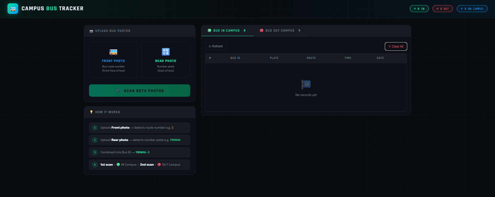
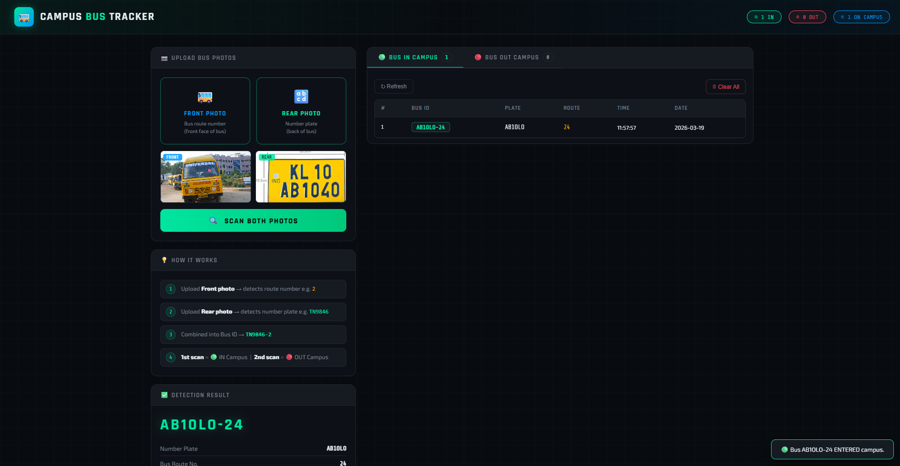
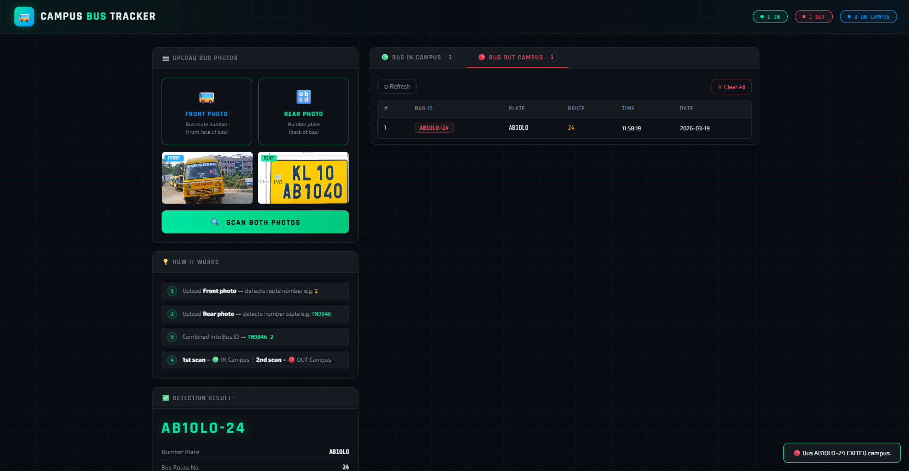

# 🚌 Campus Bus Tracking System

CNN-based bus detection using OpenCV + EasyOCR to identify number plates and bus route numbers.

## Format
```
TN9846-2
│      └─ Bus route number (detected from FRONT of bus)
└──────── Number plate     (detected from REAR of bus)
```

## Tables
| Table | Trigger |
|-------|---------|
| **Bus IN Campus** | First time bus is detected |
| **Bus OUT Campus** | Second time same bus is detected |
| Subsequent scans cycle between IN ↔ OUT |

---

## Setup

### 1. Install dependencies
```bash
pip install -r requirements.txt
```
> First run downloads EasyOCR model (~100 MB). Requires internet.

### 2. Run the app
```bash
python app.py
```

### 3. Open browser
```
http://localhost:5000
```

---

## Detection Modes

| Mode | Use When |
|------|----------|
| **Auto** | System tries both plate + number detection |
| **Plate (Rear)** | Image is from the rear of the bus |
| **Number (Front)** | Image is from the front of the bus |

---

## How Detection Works

### Number Plate (Rear)
1. **Haar Cascade** (`haarcascade_russian_plate_number.xml`) detects plate region
2. ROI is preprocessed: grayscale → resize → Gaussian blur → Otsu threshold
3. **EasyOCR** extracts alphanumeric text
4. Regex normalizes to Indian plate format (e.g. `TN98AB1234` or `TN9846`)

### Bus Number (Front)  
1. Crops upper-center region of image (where number boxes typically appear)
2. **EasyOCR** extracts 1–3 digit numbers with confidence > 0.4
3. Falls back to full-image scan if not found in crop

### Composite ID
```
plate_text + "-" + bus_number  →  TN9846-2
```

---

## Database (SQLite)

### `bus_in_campus`
| Column | Description |
|--------|-------------|
| id | Auto increment |
| bus_id | e.g. TN9846-2 |
| number_plate | e.g. TN9846 |
| bus_number | e.g. 2 |
| entry_time | HH:MM:SS |
| entry_date | YYYY-MM-DD |
| image_snapshot | Base64 JPEG |

### `bus_out_campus`
Same structure with `exit_time` / `exit_date`.

### `bus_status`
Tracks current IN/OUT state per `bus_id`.

---

## API Endpoints

| Method | Route | Description |
|--------|-------|-------------|
| GET | `/` | Dashboard UI |
| POST | `/upload` | Upload image for detection |
| GET | `/api/bus_in` | All IN records (JSON) |
| GET | `/api/bus_out` | All OUT records (JSON) |
| GET | `/api/stats` | Summary counts |
| POST | `/api/clear` | Clear all records |
| GET | `/video_feed` | Live camera MJPEG stream |
| POST | `/camera/start` | Start webcam detection |
| POST | `/camera/stop` | Stop webcam detection |

---

## Tips for Best Accuracy

1. **Lighting** — Ensure plate is well-lit, avoid glare
2. **Angle** — Near-perpendicular shots work best
3. **Resolution** — At least 640×480; higher is better
4. **Rear image** — Use "Plate" mode for cleaner detection
5. **Front image** — Use "Number" mode; ensure route number is visible

---

## Project Structure
```
bus_detection/
├── app.py              ← Main Flask app + CNN pipeline
├── requirements.txt
├── bus_tracking.db     ← SQLite (auto-created)
├── templates/
│   └── index.html      ← Dashboard UI
├── static/
│   ├── css/
│   └── js/
└── uploads/            ← Temp upload dir
```
## screen shot





